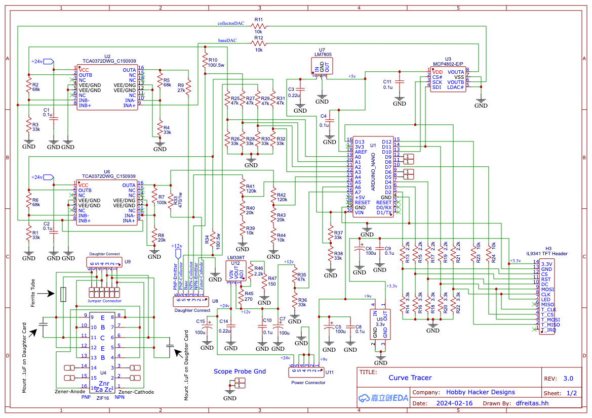
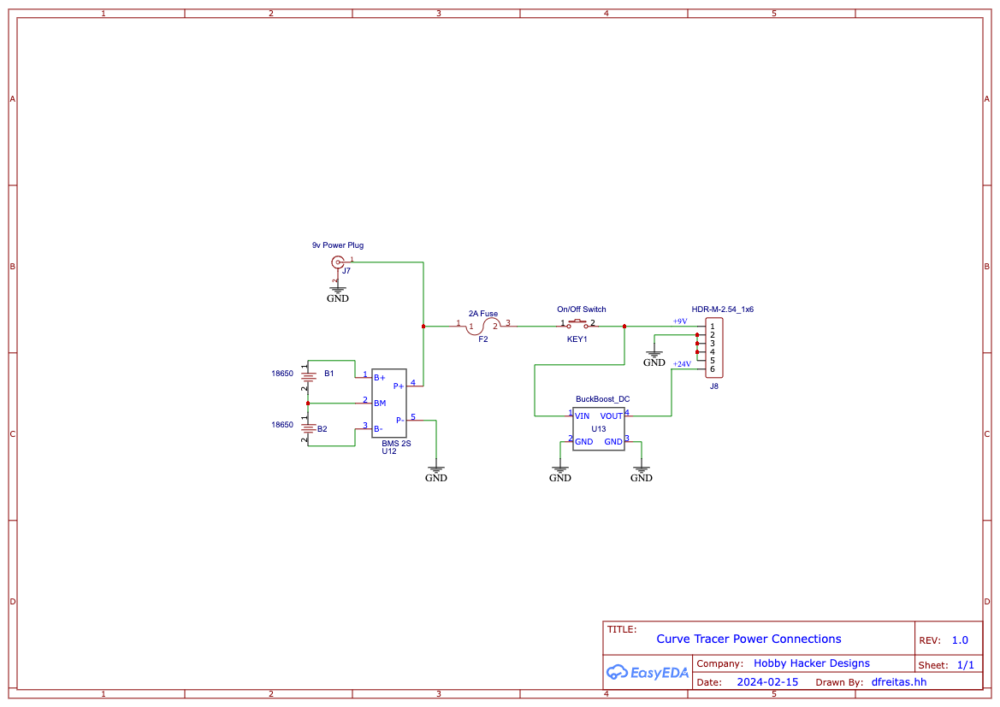

### CurveTracer

* Base code from Instructables at https://www.instructables.com/Transistor-Curve-Tracer/

* Modified to use Arduino Nano.  Modified power supply.  Now uses two lithium 18650 batteries or a 9v power supply.
Generates 3.3v and 12v using buck/boost converters.

* Added Grid Setup button to main menu.  This allows the user to set a min/max X-grid (Vce) to zoom in around different
scan points.  Useful for diodes since they have a very steep Ic and a low threshold voltage

* Added separate inc/dec buttons for setting min/max values of base-current, gate-voltage

* Added "Test-Znr" button to main menu to initiate test for zener diodes whos Vz is too close to the opAmp max to auto-trigger the test.
This lets us start the test without having to use the serial interface command.
Print Vz in the graph after scanning.  Print Vt for diodes tested forward-biased in the NPN side of the Zif.

* Added "S" command to toggle the DACs into a 0-255 sweep mode.

dlf  2/7/2024

### Schematics

### PC Board Layout

### Gerber Files
* Unzip the file: Gerber_PCB_Curvei_Tracer_Rev2.1.zip
